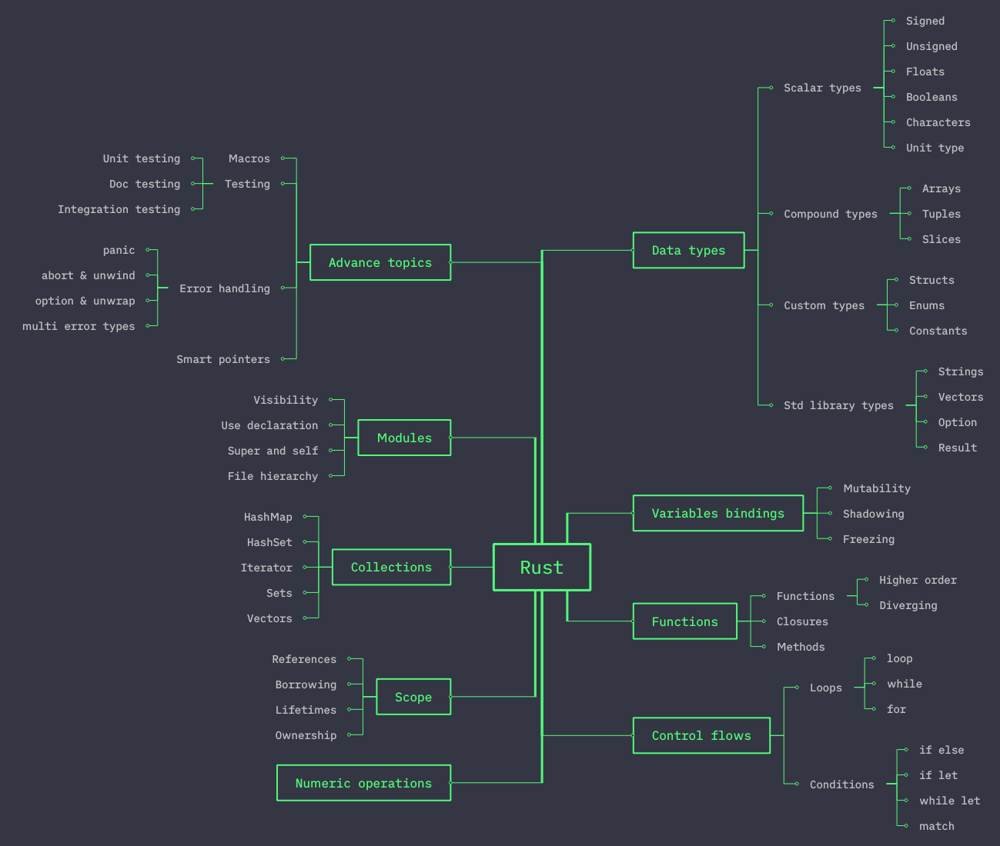

<div align="center">
   <p>
      <a href="#" >
      
      </a>
   <p/>
   <h1 style="border-bottom: none">
      RUST LANGUAGE BASICS
   </h1>
   <p>Introduction to basics of Rust programming language
   <p/>
</div>

📖 **Table of Contents**

<!-- MDTOC maxdepth:6 firsth1:0 numbering:1 flatten:0 bullets:0 updateOnSave:1 -->

1. [👋 Introducing Rust Ecosystem](#👋-introducing-rust-ecosystem)
2. [🏗️ Installation](#🏗️-installation)
3. [🛠️ Development Setup](#🛠️-development-setup)
4. [🚀 Roadmap](#🚀-roadmap)
5. [📗 Resources](#📗-resources)
6. [🛡️ License](#🛡️-license)
7. [🤝 Contributing](#🤝-contributing)

<!-- /MDTOC -->

## 👋 Introducing Rust Ecosystem

- Version manager: `rustup`
- Package manager: `cargo`
- Rust compiler: `rustc`
- Rust formatter: `rustfmt`
- Rust linter: `cargo-clippy`
- Package manifest: `Cargo.toml`
- Documentation local: `rustdoc`
- Package registry: `crates.io`

## 🏗️ Installation

Please follow the installation [guide](https://www.rust-lang.org/tools/install) to install the Rust.

## 🛠️ Development Setup

Run the project by executing the following command in the terminal from the root of project directory:

```sh
$ cargo run
```

**Or**

Install and run `cargo-watch` which will watch the project for changes and runs Cargo command on change.

- Install [`cargo-watch`](https://crates.io/crates/cargo-watch)
- Run `cargo watch -c -x run`

## 🚀 Roadmap

<div align="center">
   <p>
      <a href="#" >
      
      </a>
   <p/>
</div>

## 📗 Resources

[Rust Playground](https://play.rust-lang.org/)

[Rust by examples](https://doc.rust-lang.org/stable/rust-by-example/index.html)

## 🛡️ License

This project is licensed under the [MIT](./LICENSE) License.

## 🤝 Contributing

Pull requests are welcome.

1. Fork the repository.
2. Create your new feature branch: `git checkout -b new-feature-branch`
3. Stage your changes: `git add .`
4. Commit the changes: `git commit -m "add commit message"`
5. `push` to the branch: `git push origin new-feature-branch`
6. Submit a `pull request`.
